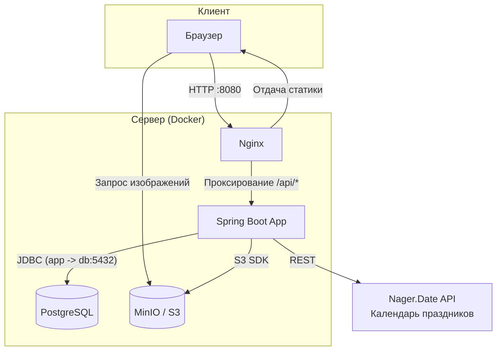

# RoomFlow - Система бронирования переговорных комнат

[](https://github.com/IWKMS99/RoomFlow/actions/workflows/ci.yml)


**RoomFlow** — это современное веб-приложение для удобного бронирования переговорных комнат в офисе. Оно предоставляет интерактивное визуальное расписание, продвинутую панель администратора и интеграции для защиты от конфликтов (включая государственные праздники).

## Основные возможности

*   **Интерактивное расписание:** Визуальное представление занятости комнат (Drag-to-select для выбора времени), защита от накладок и проверки лимитов бронирования.
*   **Панель администратора (RBAC):** Управление переговорными комнатами (CRUD), модерация пользователей (назначение ролей), управление всеми бронированиями в системе.
*   **Хранилище файлов (S3):** Загрузка изображений переговорных комнат и PDF-документов через MinIO. Изображения автоматически подтягиваются в карточки комнат.
*   **Интеграция с календарем праздников:** Интеграция с внешним API (Nager.Date) для автоматического запрета бронирований в нерабочие/праздничные дни (защищено Circuit Breaker паттерном).
*   **Продвинутый UX/UI:** Spatial UI интерфейс, плавные морфинг-анимации на базе `framer-motion`, светлая/темная темы, интернационализация (EN/RU).
*   **SEO-оптимизация:** Динамические мета-теги, JSON-LD микроразметка и автоматически генерируемый `sitemap.xml`.

<details>
<summary><strong>Стек технологий</strong></summary>

### Backend
-   **Язык:** Java 24
-   **Фреймворк:** Spring Boot 3.5.6
-   **Доступ к данным:** Spring Data JPA (Hibernate), PostgreSQL 16, Flyway
-   **Хранилище файлов:** MinIO (AWS S3 SDK)
-   **Безопасность:** Spring Security, JWT (Access + HttpOnly Refresh Cookie)
-   **Интеграции:** RestClient, Resilience4j (CircuitBreaker, Retry), Caffeine Cache
-   **API документация:** OpenAPI (Swagger UI)
-   **Качество кода:** SpotBugs, PMD, Spotless

### Frontend
-   **Библиотека:** React 19 (TypeScript)
-   **Архитектура и Стейт:** Feature-Sliced Design (частично), Zustand, React Query
-   **Роутинг:** TanStack Router
-   **Стилизация:** Tailwind CSS, clsx, tailwind-merge
-   **Анимации:** Framer Motion, @use-gesture/react
-   **Утилиты:** Zod, React Hook Form, i18next
-   **Сборка:** Vite

### DevOps
-   **Контейнеризация:** Docker, Docker Compose
-   **Веб-сервер/Прокси:** Nginx

</details>


## Архитектура

Проект представляет собой SPA-приложение на React, взаимодействующее с монолитным Spring Boot REST API. В качестве базы данных используется PostgreSQL, а для хранения медиафайлов поднято локальное S3-совместимое хранилище — MinIO.



## Требования для запуска

-   [Docker](https://www.docker.com/get-started) и Docker Compose
-   [Node.js](https://nodejs.org/) v20+ и npm (для локальной разработки)
-   [JDK](https://www.oracle.com/java/technologies/downloads/) 24 (для сборки/запуска бэкенда вне Docker)

## Запуск проекта

### 1. Подготовка конфигурации
Клонируйте репозиторий и настройте переменные окружения:
```bash
git clone https://github.com/IWKMS99/RoomFlow.git
cd RoomFlow
cp .env.example .env
```
*(В файле `.env` укажите пароли для PostgreSQL, MinIO и секретный ключ JWT).*

### 2. Режим разработки (Development)

В dev-режиме бэкенд, база данных и MinIO запускаются в Docker, а фронтенд работает локально с помощью Vite (с hot-reload).

1.  **Поднимите бэкенд и инфраструктуру:**
    ```bash
    docker-compose up --build
    ```
    * Бэкенд доступен по адресу: `http://localhost:8081`
    * MinIO Console (Файловое хранилище): `http://localhost:9001` (Креды из `.env`)

2.  **Запустите фронтенд (в новом окне терминала):**
    ```bash
    cd frontend
    npm install
    npm run dev
    ```
    Фронтенд будет доступен по адресу `http://localhost:5173`.

### 3. Режим продакшена (Production)

Запускает всё приложение (включая собранный фронтенд, отдаваемый через Nginx) в изолированной Docker-сети.

1. **Запустите все сервисы:**
    ```bash
    docker-compose -f docker-compose.prod.yml up --build -d
    ```
   Приложение будет полностью доступно по адресу `http://localhost:8080`.

2. **Остановка сервисов:**
    ```bash
    docker-compose -f docker-compose.prod.yml down
    ```

---

* **Подсказка:** При первом запуске скрипты миграций Flyway автоматически создадут дефолтного администратора.*
* **Email:** `admin@roomflow.local`
* **Пароль:** `admin123`

## Качество кода и Тестирование

Проект активно использует статические анализаторы и тесты (Playwright для e2e, Vitest для frontend, JUnit + Testcontainers для интеграционных тестов backend).

**Backend (Gradle):**
```bash
./gradlew check         # Запуск линтеров (SpotBugs, PMD) и автотестов
./gradlew spotlessApply # Форматирование кода по стандартам Palantir
```

**Frontend (NPM):**
```bash
npm run test            # Юнит-тестирование (Vitest)
npm run lint            # Проверка ESLint
npm run test:e2e        # Запуск E2E тестов (Playwright)
```

## API Документация

В режиме разработки документация API (OpenAPI 3) и удобный UI для тестирования ручек доступны встроенными средствами Swagger:
- Swagger UI: [http://localhost:8081/swagger-ui.html](http://localhost:8081/swagger-ui.html)

Фронтенд автоматически генерирует API-клиент (`orval`) на основе этой схемы (см. `npm run generate:api`).

## Лицензия

Этот проект распространяется под лицензией MIT. Подробности смотрите в файле `LICENSE`.
