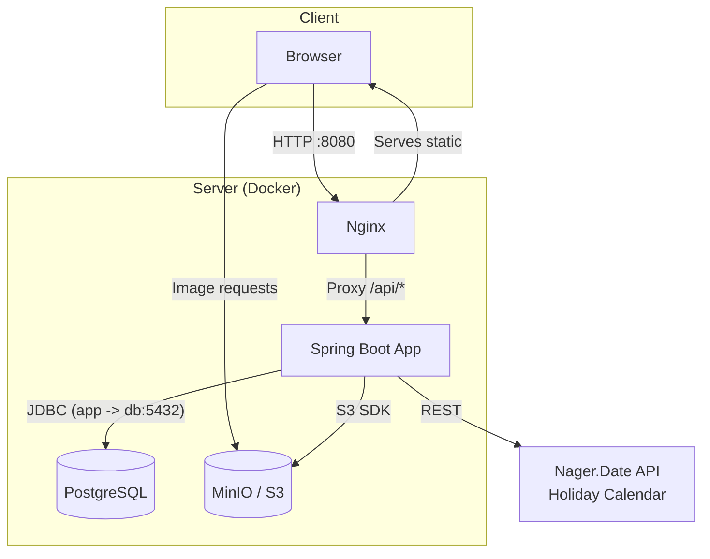

# RoomFlow - Meeting Room Booking System
[](https://github.com/IWKMS99/RoomFlow/actions/workflows/ci.yml)


**RoomFlow** is a modern web application for convenient booking of meeting rooms in the office. It provides an interactive visual schedule, an advanced admin panel, and integrations for conflict protection (including public holidays).

## Key Features
* **Interactive Schedule:** Visual representation of room occupancy (Drag-to-select for time selection), protection against overlaps and booking limit checks.
* **Admin Panel (RBAC):** Management of meeting rooms (CRUD), user moderation (role assignment), management of all bookings in the system.
* **File Storage (S3):** Upload of meeting room images and PDF documents via MinIO. Images are automatically pulled into room cards.
* **Holiday Calendar Integration:** Integration with external API (Nager.Date) for automatic prohibition of bookings on non-working/holiday days (protected by Circuit Breaker pattern).
* **Advanced UX/UI:** Spatial UI interface, smooth morphing animations based on `framer-motion`, light/dark themes, internationalization (EN/RU).
* **SEO Optimization:** Dynamic meta tags, JSON-LD microdata, and automatically generated `sitemap.xml`.

<details>
<summary><strong>Technology Stack</strong></summary>

### Backend
- **Language:** Java 24
- **Framework:** Spring Boot 3.5.6
- **Data Access:** Spring Data JPA (Hibernate), PostgreSQL 16, Flyway
- **File Storage:** MinIO (AWS S3 SDK)
- **Security:** Spring Security, JWT (Access + HttpOnly Refresh Cookie)
- **Integrations:** RestClient, Resilience4j (CircuitBreaker, Retry), Caffeine Cache
- **API Documentation:** OpenAPI (Swagger UI)
- **Code Quality:** SpotBugs, PMD, Spotless

### Frontend
- **Library:** React 19 (TypeScript)
- **Architecture & State:** Feature-Sliced Design (partial), Zustand, React Query
- **Routing:** TanStack Router
- **Styling:** Tailwind CSS, clsx, tailwind-merge
- **Animations:** Framer Motion, @use-gesture/react
- **Utilities:** Zod, React Hook Form, i18next
- **Build:** Vite

### DevOps
- **Containerization:** Docker, Docker Compose
- **Web Server/Proxy:** Nginx
</details>

## Architecture
The project is a SPA application on React that interacts with a monolithic Spring Boot REST API. PostgreSQL is used as the database, and a local S3-compatible storage — MinIO — is used for media files.



## Requirements for Running
- [Docker](https://www.docker.com/get-started) and Docker Compose
- [Node.js](https://nodejs.org/) v20+ and npm (for local development)
- [JDK](https://www.oracle.com/java/technologies/downloads/) 24 (for building/running the backend outside Docker)

## Running the Project
### 1. Configuration Preparation
Clone the repository and set up environment variables:
```bash
git clone https://github.com/IWKMS99/RoomFlow.git
cd RoomFlow
cp .env.example .env
```
*(In the `.env` file, specify passwords for PostgreSQL, MinIO, and the JWT secret key.)*

### 2. Development Mode
In dev mode, the backend, database, and MinIO run in Docker, while the frontend runs locally via Vite (with hot-reload).
1. **Start the backend and infrastructure:**
    ```bash
    docker-compose up --build
    ```
    * Backend available at: `http://localhost:8081`
    * MinIO Console (File Storage): `http://localhost:9001` (Credentials from `.env`)
2. **Start the frontend (in a new terminal window):**
    ```bash
    cd frontend
    npm install
    npm run dev
    ```
    The frontend will be available at `http://localhost:5173`.

### 3. Production Mode
Launches the entire application (including the built frontend served via Nginx) in an isolated Docker network.
1. **Start all services:**
    ```bash
    docker-compose -f docker-compose.prod.yml up --build -d
    ```
   The application will be fully available at `http://localhost:8080`.
2. **Stop services:**
    ```bash
    docker-compose -f docker-compose.prod.yml down
    ```

---
* **Hint:** On the first run, Flyway migration scripts will automatically create the default administrator.*
* **Email:** `admin@roomflow.local`
* **Password:** `admin123`

## Code Quality and Testing
The project actively uses static analyzers and tests (Playwright for e2e, Vitest for frontend, JUnit + Testcontainers for backend integration tests).

**Backend (Gradle):**
```bash
./gradlew check # Run linters (SpotBugs, PMD) and autotests
./gradlew spotlessApply # Code formatting according to Palantir standards
```

**Frontend (NPM):**
```bash
npm run test # Unit testing (Vitest)
npm run lint # ESLint check
npm run test:e2e # Run E2E tests (Playwright)
```

## API Documentation
In development mode, OpenAPI 3 documentation and a convenient UI for testing endpoints are available via built-in Swagger:
- Swagger UI: [http://localhost:8081/swagger-ui.html](http://localhost:8081/swagger-ui.html)

The frontend automatically generates an API client (`orval`) based on this schema (see `npm run generate:api`).

## License
This project is distributed under the MIT license. See the `LICENSE` file for details.
