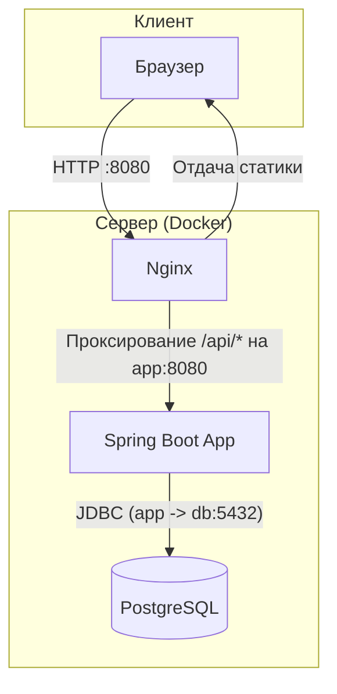

# RoomFlow - Система бронирования переговорных комнат

[](https://github.com/IWKMS99/RoomFlow/actions/workflows/ci.yml)


**RoomFlow** — это веб-приложение для удобного бронирования переговорных комнат в офисе. Оно позволяет пользователям просматривать расписание занятости, создавать новые бронирования и управлять уже существующими.

## 🚀 Основные возможности

*   **Аутентификация пользователей:** Регистрация и вход с использованием JWT.
*   **Журнал занятости:** Визуальное представление расписания всех комнат по часам на выбранную дату.
*   **Создание бронирований:** Простой интерфейс для выбора даты, времени и доступной комнаты.
*   **Управление бронированиями:** Просмотр списка своих активных и прошедших бронирований, возможность отмены.
*   **Валидация:** Проверка на конфликты бронирования и корректность вводимых данных на стороне бэкенда.

<details>
<summary><strong>🛠️ Стек технологий</strong></summary>

### Backend
-   **Язык:** Java 21
-   **Фреймворк:** Spring Boot 3
-   **Доступ к данным:** Spring Data JPA (Hibernate)
-   **База данных:** PostgreSQL
-   **Миграции БД:** Flyway
-   **Безопасность:** Spring Security (JWT)
-   **API документация:** OpenAPI (Swagger UI)
-   **Сборка:** Gradle
-   **Качество кода:** SpotBugs, PMD, Spotless

### Frontend
-   **Библиотека:** React 19 (с использованием TypeScript)
-   **Роутинг:** React Router
-   **HTTP-клиент:** Axios
-   **Сборка:** Vite

### DevOps
-   **Контейнеризация:** Docker, Docker Compose
-   **Веб-сервер/Прокси:** Nginx

</details>


## 🏗️ Архитектура

Проект представляет собой монолитное бэкенд-приложение на Spring Boot, которое предоставляет REST API. Бэкенд построен по модульному принципу (`booking`, `user`) для лучшего разделения логики.

Фронтенд — это приложение на React, которое взаимодействует с бэкендом по API.

В production-окружении используется Nginx, который выполняет две функции:
1.  Отдает статичные файлы фронтенда.
2.  Выступает в роли reverse proxy для всех запросов к API (`/api`), перенаправляя их на бэкенд-приложение.



## 📋 Требования для запуска

-   [Docker](https://www.docker.com/get-started) и Docker Compose
-   [Node.js](https://nodejs.org/) v20+ и npm
-   [JDK](https://www.oracle.com/java/technologies/downloads/) 21 (для запуска бэкенда вне Docker)

## ⚙️ Запуск проекта

### 1. Подготовка
1.  Клонируйте репозиторий:
    ```bash
    git clone https://github.com/IWKMS99/RoomFlow.git
    cd RoomFlow
    ```

2.  Создайте файл `.env` в корне проекта, скопировав содержимое из `.env.example`.
    ```bash
    Можно использовать команду 'cp .env.example .env' в Linux/macOS
    или 'copy .env.example .env' в Windows
    ```

### 2. Режим разработки (Development)

В этом режиме бэкенд и база данных запускаются в Docker, а фронтенд — локально с помощью Vite для удобства разработки и hot-reload.

1.  **Запустите бэкенд и базу данных:**
    ```bash
    docker-compose up --build
    ```
    Бэкенд будет доступен по адресу `http://localhost:8081`.

2.  **Запустите фронтенд (в новом терминале):**
    ```bash
    cd frontend
    npm install
    npm run dev
    ```
    Фронтенд будет доступен по адресу, который укажет Vite (обычно `http://localhost:5173`).

### 3. Режим продакшена (Production)

В этом режиме все компоненты (база данных, бэкенд, фронтенд с Nginx) запускаются в Docker-контейнерах.

1. **Запустите все сервисы:**
    ```bash
    docker-compose -f docker-compose.prod.yml up --build -d
    ```
    Приложение будет доступно по адресу `http://localhost:8080`.

2. **Для просмотра логов:**
    ```bash
    docker-compose -f docker-compose.prod.yml logs -f
    ```

3. **Для остановки сервисов:**
    ```bash
    docker-compose -f docker-compose.prod.yml down
    ```

## ✅ Качество кода и Тестирование

Проект использует статические анализаторы для поддержания высокого качества кода.

-   **Запуск всех проверок (анализаторы + тесты):**
    ```bash
    ./gradlew check
    ```
-   **Запуск только интеграционных тестов:**
    ```bash
    ./gradlew test
    ```
-   **Форматирование кода:**
    ```bash
    ./gradlew spotlessApply
    ```

## 📚 API Документация

После запуска бэкенда (в любом режиме) документация API доступна через Swagger UI.
-   В **dev-режиме**: [http://localhost:8081/swagger-ui.html](http://localhost:8081/swagger-ui.html)
-   В **prod-режиме** документация доступна внутри Docker-сети, но не выставлена наружу через Nginx.

## 📄 Лицензия

Этот проект распространяется под лицензией MIT. Подробности смотрите в файле `LICENSE`.